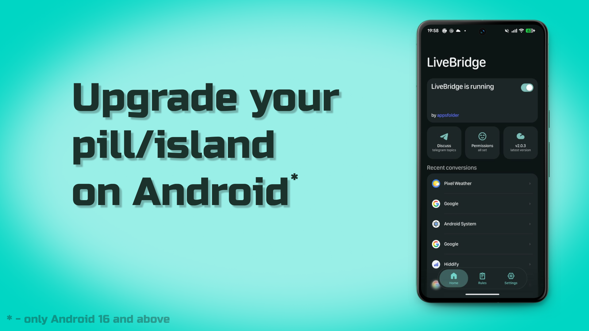
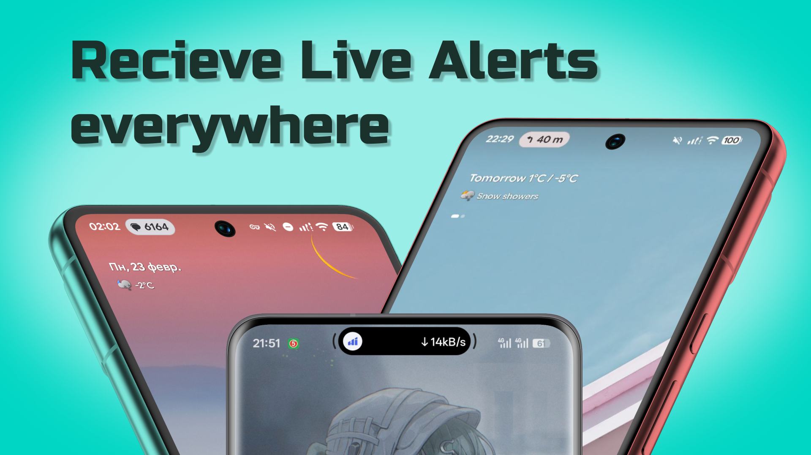
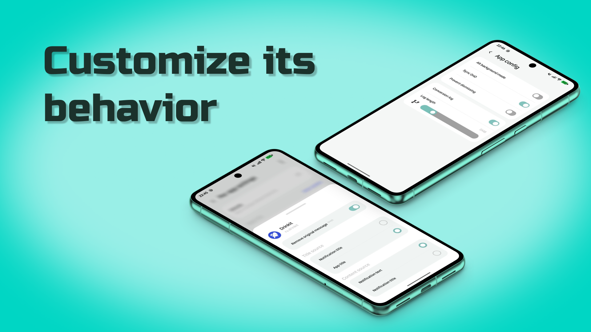

# LiveBridge
> This app is a fork of the [livebridge](https://github.com/appsfolder/livebridge), which uses the Samsung whitelisted and closed API for the Now Bar and uses a spoof for com.locnall.KimGiSa to avoid whitelist

LiveBridge is a Flutter Android app with native Kotlin logic that converts regular notifications into Android Live Updates (Live Activity-like UX on Android 16+)

## Download

If you just want to install the app, use the download page:

- https://appsfolder.github.io/livebridge/

Before installing the APK:

- Use Android 16 or newer
- Disable Play Protect during installation

## Discussion

For feature discussions, testing notes, and development topics, use the LiveBridge Telegram topics:

- https://t.me/livebridge_dev

## For Users

LiveBridge is made for users first. You do not need to build the project yourself unless you want to contribute or test version changes.

## Screenshots

### First Slide



### Second Slide



### Third Slide



## Core features

- Converts progress notifications into Live Updates
- Smart status detection (taxi, delivery, food order flows, even weather)
- OTP code extraction from notifications
- Real-time island navigation
- App filtering modes
- Per-app presentation overrides
- Much, much more

## Small features you'll love

- Haptic feedback
- Predictive back gesture
- Edge-to-edge layout without app bars
- Customizable parsing dictionaries
- Dictionary auto-update
- Decent FGS
- Animated dynamic island

## Exclusive features

- Xiaomi's native Hyper Island (shout out to [D4vidDf](https://github.com/D4vidDf/HyperIsland-ToolKit))
- Samsung Now Bar API 

## Requirements

- Flutter SDK 3.9+
- Android SDK configured to compile and target Android 16
- Android 16+ device

## Quick Start

```bash
flutter pub get
flutter run
```

## Build

Debug APK:

```bash
flutter build apk --debug
```

Release APK:

```bash
flutter build apk --release
```

## Permissions and Device Setup

For stable behavior, the app usually needs:

- Notification Listener access
- Notification permission for LiveBridge itself
- Live Updates permission (where required by system/vendor)
- Background activity/battery exclusion on some OEM ROMs

## Known Issues

- On AOSP, app icon and label behavior may differ from OEM firmware
- AoD and `isOngoing` behavior vary across OEM vendors

- NOT WORKING on Chinese OriginOS
- NOT WORKING on CMF devices
- Working badly on Nothing devices without Progress Glyph indicators

## Notes

- Feel free to open issues or pull requests. LiveBridge is under active development
- Testing on multiple OEMs is highly recommended

## License

LiveBridge is licensed under GPL-3.0-or-later. See [LICENSE](LICENSE).

Redistributed builds, forks, and modified versions must preserve the attribution
notice in [NOTICE](NOTICE), clearly identify themselves as based on the original
LiveBridge project, and provide corresponding source code when distributing
APK builds or other binaries.

## Credits

- [D4vidDf](https://github.com/D4vidDf/HyperIsland-ToolKit) for the Hyper Island toolkit
- [RossSihovsk](https://github.com/RossSihovsk/LiveMedia) for the Live Media

